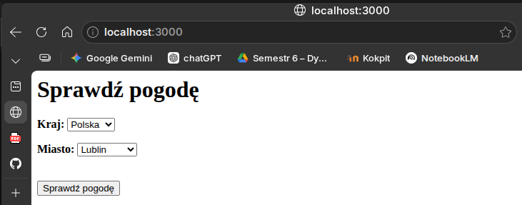
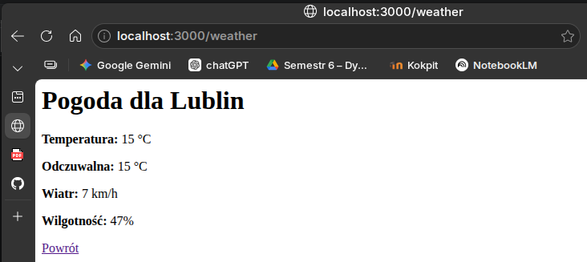
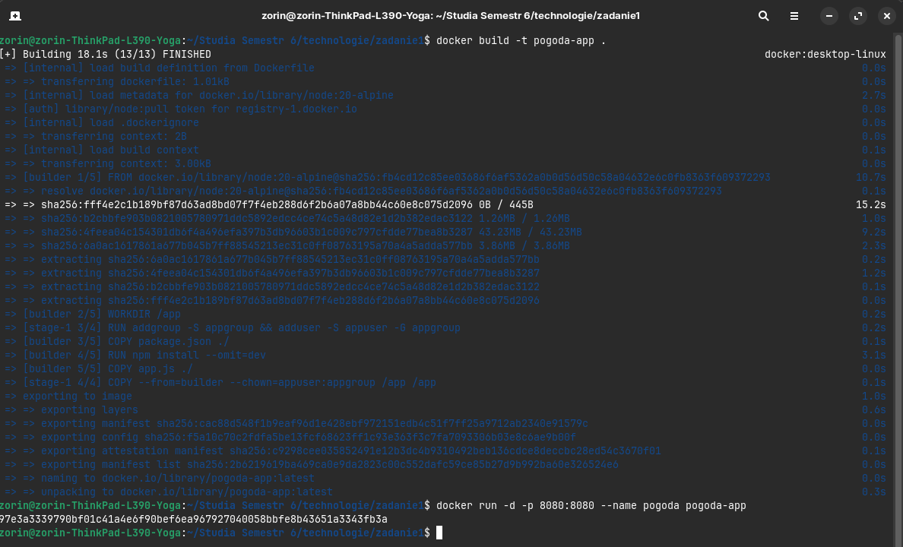
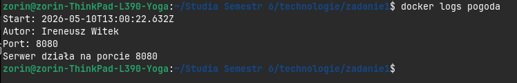
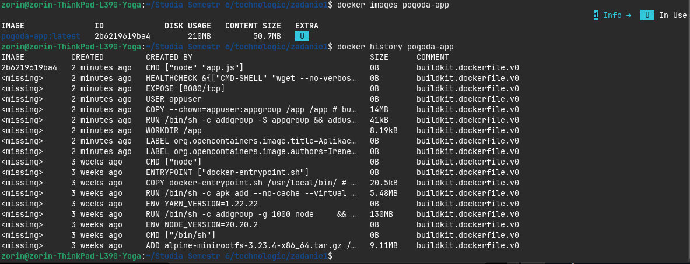
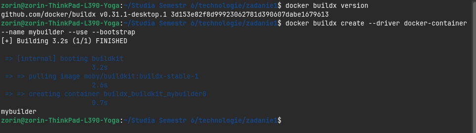
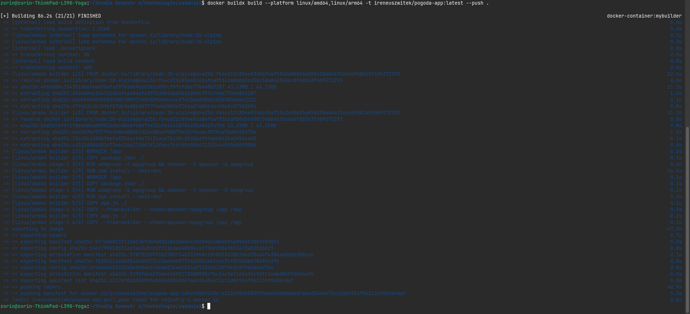
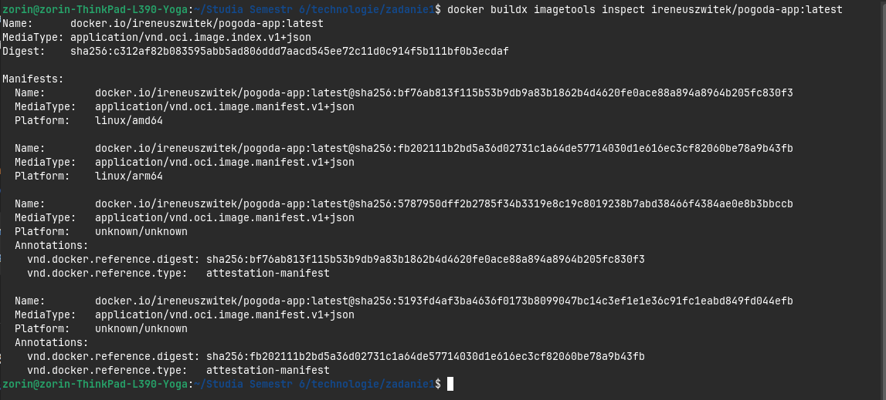

# Technologie Chmurowe — Zadanie 1 #

## Autor: Ireneusz Witek ##

## Opis zadania: ##
Aplikacja jest prostą stroną internetową uruchamianą w kontenerze Docker, która umożliwia sprawdzenie podstawowych informacji o aktualnej pogodzie dla wybranego miasta. Dane pogodowe pobierane są z serwisu wttr.in i prezentowane w przejrzystym interfejsie WWW. Po uruchomieniu kontenera generowane są logi zawierające datę, autora i port TCP. 

W projekcie zastosowano również:
- optymalizację cache podczas instalacji zależności,
- mechanizm `HEALTHCHECK` monitorujący stan aplikacji,
- uruchamianie aplikacji z poziomu użytkownika nie-root,
- zgodność ze standardem OCI poprzez dodanie odpowiednich etykiet obrazu.

## Działanie aplikacji: ##



## a. Budowanie obrazu

```bash
docker build -t pogoda-app .
```
## b. Uruchomienie kontenera

```bash
docker run -d -p 8080:8080 --name pogoda pogoda-app
```


## c. Uzyskanie informacji z logów

```bash
docker logs pogoda
```


## d. Sprawdzenie ilości warstw oraz rozmiaru obrazu

```bash
docker history pogoda-app
```


## Część DODATKOWA ##
## Zadanie 1 ##
W ramach zadania przygotowano obraz kontenera zgodny ze standardem OCI przeznaczony dla dwóch platform sprzętowych:

- `linux/amd64`
- `linux/arm64`

Do budowy obrazu wykorzystano mechanizm `Docker Buildx` oraz builder oparty na sterowniku `docker-container`.

## Utworzenie buildera ##

```bash
docker buildx create --driver docker-container --name mybuilder --use --bootstrap
```


## Budowanie i publikacja obrazu wieloplatformowego

```bash
docker buildx build \
--platform linux/amd64,linux/arm64 \
-t ireneuszwitek/pogoda-app:latest \
--push .
```
 

## Weryfikacja manifestu OCI

W celu potwierdzenia poprawności utworzonego manifestu wykorzystano polecenie:

```bash
docker buildx imagetools inspect ireneuszwitek/pogoda-app:latest
```
 
